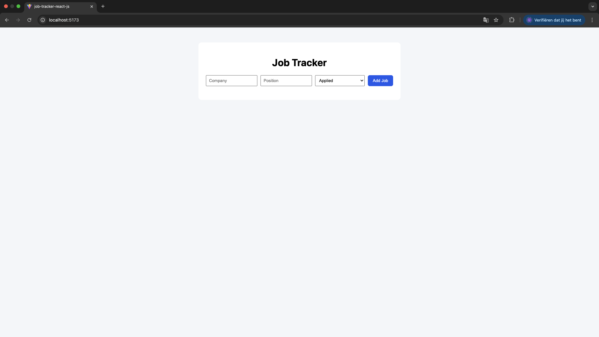
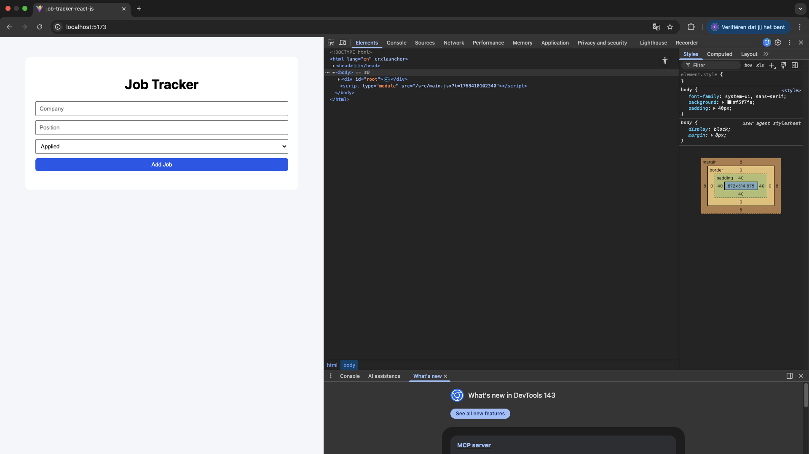
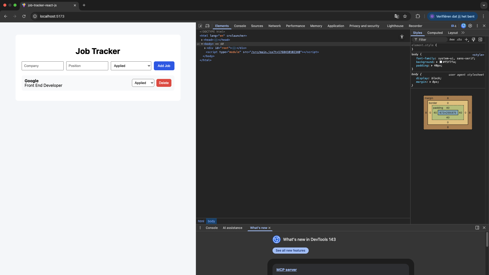
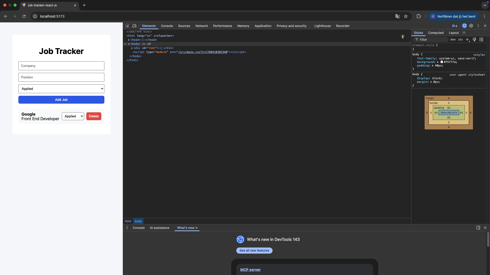

# 📌 Job Tracker App

A modern and responsive **Job Application Tracker** built with **React**.  
This application helps users keep track of their job applications by adding, updating, and deleting job entries, with data persisted in the browser using `localStorage`.

---

## 🚀 Live Demo
👉 (optional – add after deploy)  
https://job-tracker-yourname.vercel.app

---

## ✨ Features

- Add job applications (company, position, status)
- Update job application status (Applied / Interview / Rejected)
- Delete job entries
- Form validation with user feedback
- Success and error messages with smooth animations
- Persistent data storage using `localStorage`
- Fully responsive design (desktop, tablet, mobile)
- Clean and intuitive user interface

---

## 🛠 Tech Stack

- React (Hooks: `useState`, `useEffect`)
- JavaScript (ES6+)
- CSS3 (Flexbox, Media Queries)
- Vite
- Git & GitHub

---

## ⚙️ Getting Started

Follow the steps below to run the project locally:

```bash
# Clone the repository
git clone https://github.com/TheDutchman68/job-tracker-react-js

# Navigate to the project folder
cd job-tracker

# Install dependencies
npm install

# Start development server
npm run dev

# The app will be available at:
http://localhost:5173
```

## 🧠 What I Learned

- Structuring a React project using reusable components
- Managing application state with useState
- Handling side effects and persistence using useEffect
- Implementing CRUD functionality in React
- Form validation and UX feedback handling
- Persisting data in localStorage
- Creating responsive layouts using CSS media queries
- Improving user experience with feedback messages
- Writing clean, readable, and maintainable React code
- Using Git and GitHub for version control and feature-based commits

## 🔮 Possible Improvements

- Add authentication (login/register)
- Add filtering and search functionality
- Add backend support (Node.js + MongoDB)
- Cloud-based data storage
- Dark mode
- Export data to CSV


## 📸 Screenshots

### Desktop



### Tablet



### Mobile



## 👤 Author

Natanael Dobie
Frontend Developer (React)

- GitHub: https://github.com/TheDutchman68
- LinkedIn: www.linkedin.com/in/natanael-dobie-776059249

## 📄 License

This project is licensed under the MIT License.